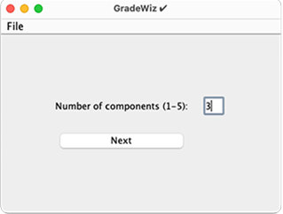
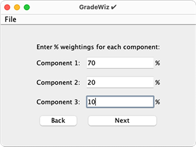
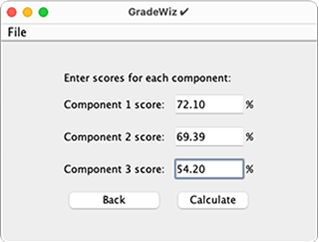
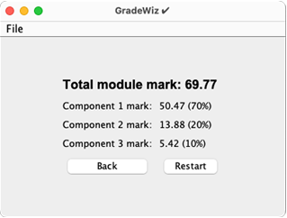
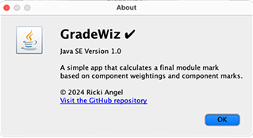

# GradeWiz ✔ (Java SE Version / Cross-Platform)
<table>
Welcome to GradeWiz! 🎓✨


GradeWiz is a simple and intuitive Java application to help students calculate their module grades based on component weightings and scores. Whether you're managing your coursework, projects, or exams, GradeWiz provides an easy way to determine your overall module mark.


<table>

  <tr>
    <td></td>
    <td></td>
  </tr>
  <tr>
    <td></td>
    <td></td>
  </tr>
</table>

## 🚀 Features

✔ User-Friendly Interface: A sleek panel-based graphical user interface with a modern look and feel.
✔ Component Weightings: Input percentage weightings for up to 5 components and ensure they add up to 100%.
✔ Score Entry: Enter scores for each component to calculate your final module mark.
✔ Results Summary: View a detailed breakdown of your component marks and the final calculated grade.
✔ Reset and Restart Options: Easily reset the application or restart the process to calculate new grades.

## 📋 How to Use

1. **Start the Application**: Launch the GradeWiz application and you will be greeted with the main menu.
2. **Enter the Number of Components**: Input the number of components for which you need to calculate grades (1 to 5).
3. **Input Weightings**: Enter the percentage weightings for each component, ensuring the total sums to 100%.
4. **Enter Scores**: Provide the scores you achieved for each component.
5. **View Results**: Calculate your final module mark and see a detailed breakdown of how each component contributed to your final grade.
6. **Reset or Restart**: Use the options in the menu to start over or adjust your inputs.

## 💻 Installation

To set up **GradeWiz-JavaSE** on your local machine, follow these steps:

1. **Clone the Repository**:

   Clone the repository to your local machine using the following command:

    ```bash
    git clone https://github.com/TechAngelX/GradeWiz-JavaSE.git
    ```

2. **Navigate to the Project Directory**:

   Change to the project directory where the `src` folder is located. Let’s assume it’s located at `/GradeWiz-JavaSE`:

    ```bash
    cd GradeWiz-JavaSE
    ```

3. **Compile the Code**:

   Use the `javac` command to compile the Java source files. Ensure you have the Java Development Kit (JDK) installed and `javac` is available in your PATH:

    ```bash
    mkdir -p bin
    javac -d bin src/**/*.java
    ```

   This command compiles all `.java` files from the `src` directory and outputs the compiled `.class` files into the `bin` directory.

4. **Run the Application**:

   After compilation, use the `java` command to run the main application class. Replace `com.techangelx.gradeWiz.Main` with the fully qualified name of your main class:

    ```bash
    java -cp bin com.techangelx.gradeWiz.Main
    ```

   This command starts the application, allowing you to interact with it through the command line or graphical interface.


## 🛠️ Technologies Used

- **Java**: The programming language used for building the desktop application.
- **JavaFX**: The GUI toolkit used for creating the graphical interface.


## 📄 License


Licensed under the GNU General Public License v3.0

## 🧑‍💻 Author

**Ricki Angel**  
Creator of GradeWiz ✔[LinkedIn](https://www.linkedin.com/in/ricki-angel/) | [GitHub](https://github.com/TechAngelX)

This is a basic demonstration project and provided 'as is. For production use, consider additional security measures.

## 🤝 Contributing

We welcome contributions from the community! If you have suggestions for improvements or new features, feel free to open an issue or submit a pull request.

If you enjoyed this project and found it useful, please feel free to leave a Bitcoin donation and buy us a coffee:

<div style="text-align: center;">
    
    <p style="font-size: 18px;">Support us with Bitcoin</p>
    <p><strong>BTC Address:<strong> bc1ql63v3wnn0wjw824m9r4peeajm7ynhzt2wqdmhc</Strong></p>
&copy; Ricki Angel 2024

</div>
</table>
